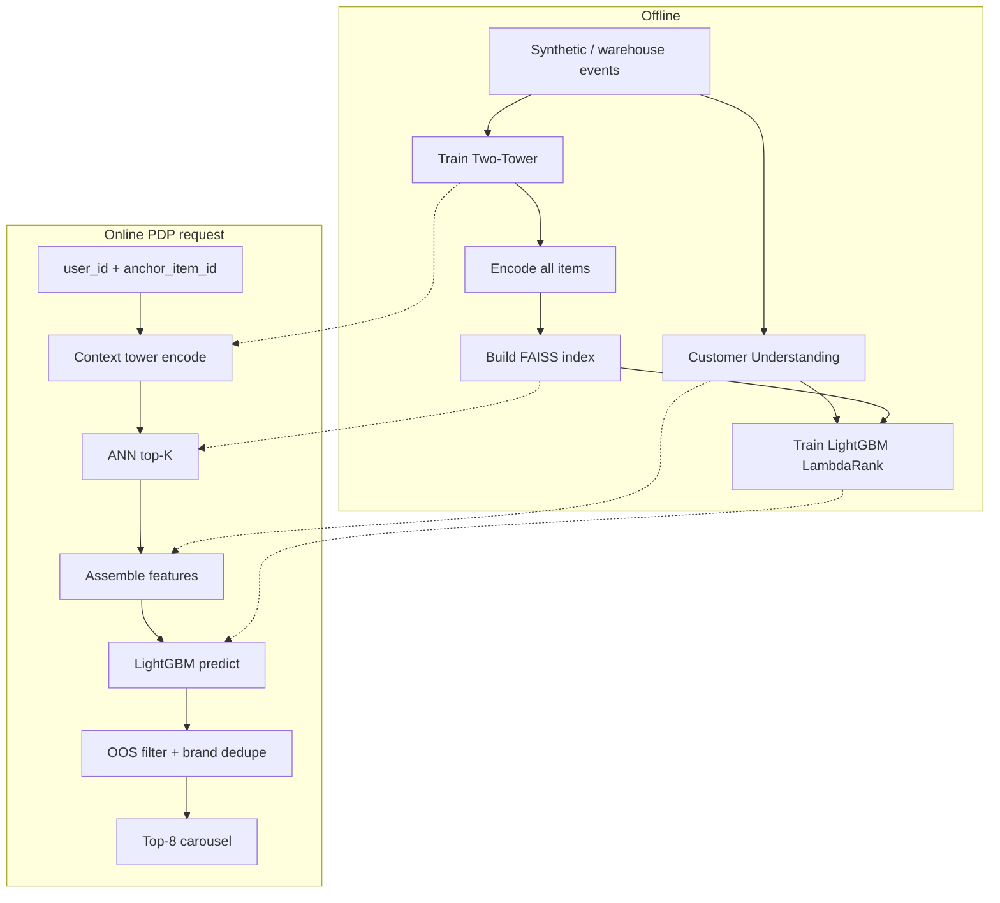

# E-commerce PDP Recommender

**Two-Tower retrieval → FAISS ANN → LightGBM LambdaRank**

End-to-end, production-shaped simulation of the system behind the resume bullet:

> *"Engineered a two-stage product recommendation system using Two-Tower retrieval and a LightGBM ranker for large-scale e-commerce product pages."*

This package trains and serves **personalized product recommendations for Product Detail Pages (PDPs)** — the Same Items / “customers also bought” style carousels on a large e-commerce site. It does **not** ship proprietary retailer logs. It uses a **structurally faithful synthetic catalog + engagement funnel** that mirrors production PDP personalization stacks, so you can run the full system locally and speak to every design choice in interviews.

---

## Table of contents

1. [Business context](#1-business-context)
2. [Engineering architecture](#2-engineering-architecture)
3. [Data model](#3-data-model)
4. [Stage 1 — Two-Tower retrieval](#4-stage-1--two-tower-retrieval)
5. [Stage 2 — LightGBM ranker](#5-stage-2--lightgbm-ranker)
6. [Serving path](#6-serving-path)
7. [Quickstart](#7-quickstart)
8. [CLI reference](#8-cli-reference)
9. [Evaluation](#9-evaluation)
10. [Interview talking points](#10-interview-talking-points)
11. [Repository layout](#11-repository-layout)
12. [Relationship to published industry work](#12-relationship-to-published-industry-work)

---

## 1. Business context

### What problem are we solving?

When a shopper opens a **product page** (e.g. a blender, a pack of diapers, a TV), large e-commerce sites surface recommendation modules such as:

| Module (typical PDP) | Intent |
|------------------------|--------|
| **Similar items (SIR)** | Substitutes for the anchor SKU |
| **Bought also bought (BAB)** | Complementary / co-purchased items |
| **View ultimately bought (VUB)** | Items viewed that later convert |

Goals (in priority order for most PDP rails):

1. **Relevance** — show items the shopper would actually consider.
2. **Engagement** — clicks, add-to-cart (ATC).
3. **Conversion / GMV** — purchases and basket value.
4. **Constraints** — in-stock, fulfillment eligibility, brand diversity, policy.

### Why two stages?

Retail-scale catalogs are **tens of millions of SKUs**. Scoring every SKU with a heavy model per request is impossible under PDP latency budgets (often **tens of milliseconds** end-to-end for the reco call).

| Stage | Job | Scale | Latency target |
|-------|-----|-------|----------------|
| **Retrieval** | Find ~100–500 *plausible* candidates | Whole catalog via ANN | ~1–5 ms |
| **Ranking** | Order those candidates for *this user + this anchor* | Hundreds of rows | ~5–20 ms |

This matches the published **SPIR**-style pattern used in large retail personalization: keep a strong recall set, then personalize with a re-ranker using **Customer Understanding** (brand, price, …).

---

## 2. Engineering architecture



### Module responsibilities

| Package | Responsibility |
|---------|----------------|
| `ecommerce_rec.data` | Schema, synthetic generator, temporal split, engagement weights |
| `ecommerce_rec.retrieval` | Two-Tower model, InfoNCE training, FAISS index |
| `ecommerce_rec.ranking` | Customer Understanding features, LambdaRank train/eval |
| `ecommerce_rec.serving` | Production-shaped `PDPRecommender.recommend()` |
| `ecommerce_rec.cli` | One CLI for the full lifecycle |

---

## 3. Data model

### Why synthetic data?

Retailers do **not** publish full PDP behavioral logs for training. Production papers on EBR, SPIR, and similar-item GNN systems use proprietary data. This project generates a **proxy** with the same *shapes* you’d find in a feature store / event warehouse:

### Tables

**`products`** — catalog snapshot

| Column | Meaning |
|--------|---------|
| `item_id` | SKU surrogate key |
| `title` | Text title (category + brand) |
| `brand_id`, `category_id` | Taxonomy |
| `price`, `price_band` | Raw price + SPIR-style 5-band within category |
| `avg_rating`, `n_reviews` | Social proof |
| `in_stock` | Inventory flag for serving filters |

**`users`** — customer priors (latent prefs used only to *simulate* behavior)

| Column | Meaning |
|--------|---------|
| `preferred_category`, `preferred_brand`, `price_affinity` | Ground-truth preferences for data generation |
| `activity_level` | sparse / medium / dense |

**`events`** — PDP funnel logs

| Column | Meaning |
|--------|---------|
| `user_id`, `item_id` | Actor + engaged candidate |
| `anchor_item_id` | Product page being viewed |
| `event_type` | `impression` → `click` → `add_to_cart` → `purchase` |
| `timestamp`, `session_id` | Temporal ordering |

**`co_purchase`** — undirected edges `(item_a, item_b, count)` for item–item features.

### Engagement labels (EBR-style weights)

```
weight = 0.001·impressions + 0.01·clicks + 0.1·ATC + 1.0·orders
```

Retrieval training keeps pairs with at least click weight; ranking uses binary positives (clicked/ATC/purchased) within retrieved candidate sets.

### Temporal split

Events are sorted by time; the last **`test_fraction`** (default 15%) is held out. This avoids leaking future engagement into training (production-critical).

---

## 4. Stage 1 — Two-Tower retrieval

### Conceptual

Two encoders, trained to put **compatible** context/item vectors close in cosine space:

```
Context tower:  [user_id emb | mean(history item embs) | anchor item emb] → MLP → û
Item tower:     [item_id | brand | category | numeric price/rating] → MLP → v̂

score(û, v̂) = cosine(û, v̂) = û · v̂   (both L2-normalized)
```

**Why this works online:** all item vectors `v̂` are computed **offline** and stored in FAISS. On a PDP hit you only encode the context once and run ANN search — O(log N) / IVF or exact IP for smaller catalogs.

### Training objective

**In-batch InfoNCE** (softmax over batch cosine similarities / temperature):

- Positive: engaged item for that context row
- Negatives: other items in the mini-batch

This is the standard dual-encoder recipe used in search EBR and recsys retrieval at large e-commerce platforms.

### Artifacts

| File | Contents |
|------|----------|
| `artifacts/two_tower.pt` | Checkpoint + meta (vocab sizes, dims) |
| `artifacts/item_embeddings.npy` | Full catalog vectors |
| `artifacts/faiss.index` | Inner-product ANN index |
| `artifacts/retrieval_metrics.json` | Train loss curve |

---

## 5. Stage 2 — LightGBM ranker

### Conceptual

Retrieval is coarse. The ranker adds **cross features** and non-linear interactions that dual-encoders underuse:

| Feature group | Examples |
|---------------|----------|
| Retrieval | `retrieval_score`, `retrieval_rank` |
| Customer Understanding | `brand_affinity`, `price_affinity_match` |
| Anchor–candidate | `same_category`, `same_brand`, `price_band_delta`, `co_purchase_score` |
| Item quality | `log_price`, `avg_rating`, `log_n_reviews`, `in_stock` |
| User activity | `log_user_train_cnt` |

### Label construction

For each training query `(user, anchor)`:

1. Run ANN → top `candidate_k` items  
2. Positives = engaged items from logs (ensure they are in the list)  
3. Sample negatives from non-engaged candidates  
4. Group rows by query for **LambdaRank** (`objective: lambdarank`)

LambdaRank directly targets ranking metrics (NDCG), which is why tree rankers remain standard after neural retrieval in industry stacks.

### Artifacts

| File | Contents |
|------|----------|
| `artifacts/lgbm_ranker.txt` | LightGBM booster |
| `artifacts/customer_understanding.pkl` | Brand / price affinity maps |
| `artifacts/co_lookup.pkl` | Normalized co-purchase scores |
| `artifacts/ranker_train_metrics.json` | Valid NDCG / best iteration |
| `artifacts/eval_metrics.json` | Holdout retrieval vs two-stage NDCG |

---

## 6. Serving path

```python
from ecommerce_rec.config import load_config
from ecommerce_rec.serving import PDPRecommender

cfg = load_config("configs/default.yaml")
reco = PDPRecommender(cfg)
items = reco.recommend(user_id=42, anchor_item_id=105)  # top-8
```

Post-ranker business rules (configurable):

- Drop out-of-stock SKUs  
- Optional brand de-duplication for carousel diversity  

---

## 7. Quickstart

Requires **Python 3.9+**.

```bash
cd ecommerce_pdp_recommender
python3 -m venv .venv
source .venv/bin/activate   # Windows: .venv\Scripts\activate
pip install -r requirements.txt
pip install -e .

# Full pipeline (default scale — several minutes on CPU)
python scripts/run_pipeline.py --config configs/default.yaml run-all

# Fast smoke path
python scripts/run_pipeline.py --config configs/smoke.yaml run-all

# Demo a PDP response
python scripts/run_pipeline.py --config configs/smoke.yaml demo
```

### macOS + LightGBM

If import fails on `libomp`:

```bash
brew install libomp
```

If PyTorch and LightGBM conflict on OpenMP (rare segfaults), run with:

```bash
export KMP_DUPLICATE_LIB_OK=TRUE
export OMP_NUM_THREADS=1
```

---

## 8. CLI reference

```bash
python scripts/run_pipeline.py [--config CONFIG] <command>
```

| Command | Description |
|---------|-------------|
| `generate-data` | Write synthetic parquet tables under `data/processed/` |
| `train-retrieval` | Train Two-Tower |
| `build-index` | Export item embeddings + FAISS |
| `train-ranker` | Train LightGBM LambdaRank |
| `evaluate` | Offline NDCG (retrieval vs two-stage, sparse/dense) |
| `demo` | Print top-K for a user/anchor (`--user-id`, `--anchor-id`) |
| `run-all` | All of the above in order |

---

## 9. Evaluation

Primary offline metric: **NDCG@8** (similar-item PDP studies often report @8 because shoppers see ~two rows of four).

Reported in `artifacts/eval_metrics.json`:

| Key | Meaning |
|-----|---------|
| `ndcg_retrieval` | ANN order only |
| `ndcg_two_stage` | After LightGBM re-rank |
| `delta_two_stage_minus_retrieval` | Lift from Stage 2 |
| `*_sparse` / `*_dense` | Cohorts by train interaction count |

Expect **two-stage ≥ retrieval** on average when Customer Understanding features are informative. Exact numbers vary with the synthetic seed and scale.

---

## 10. Interview talking points

**60-second pitch**

> On product pages we can’t score the full catalog per request. I built a two-stage system: a Two-Tower dual encoder embeds the shopper context and the anchor product, retrieves the top few hundred SKUs via FAISS, then a LightGBM LambdaRank model reorders those candidates using retrieval scores plus Customer Understanding features — brand affinity, price-band match, co-purchase strength, and catalog quality signals. Serving encodes context online, looks up a precomputed item index, ranks on CPU, and applies business filters. Offline we measure NDCG@K for retrieval-only vs two-stage and split sparse vs dense users.

**Hard questions ready**

| Question | Answer sketch |
|----------|----------------|
| Why not one big cross-encoder? | Too slow at catalog scale; cross-attention over millions of items isn’t feasible in PDP latency SLOs. |
| Why trees after neural retrieval? | Listwise NDCG objective, rich tabular cross-features, fast CPU inference, independent iteration from retrieval. |
| Cold-start item? | Item tower uses brand/category/price — new SKUs get embeddings without collaborative history. |
| Cold-start user? | History mean masks out; user id emb + anchor still retrieve; ranker falls back to item–item features. |
| Leakage? | Strict temporal split; history only uses events **before** the query timestamp. |
| How would this change with real production data? | Same pipelines; swap generator for warehouse extracts; add omnichannel events, margin/inventory features, online A/B on ATC/GMV. |

---

## 11. Repository layout

```
ecommerce_pdp_recommender/
├── README.md
├── LICENSE
├── requirements.txt
├── pyproject.toml
├── configs/
│   ├── default.yaml          # Portfolio-scale defaults
│   └── smoke.yaml            # CI / quick local run
├── scripts/run_pipeline.py
├── src/ecommerce_rec/
│   ├── cli.py
│   ├── config.py
│   ├── data/generate.py
│   ├── retrieval/{model,train,faiss_index}.py
│   ├── ranking/{features,train,evaluate}.py
│   └── serving/__init__.py
├── tests/
└── artifacts/                # gitignored outputs
```

---

## 12. Relationship to published industry work

This implementation is an **architecture-faithful open simulation** of production PDP recommenders at large e-commerce retailers — guided by public research, not a claim of access to any internal systems:

| Public work | What we mirror |
|-------------|----------------|
| [SPIR (Sinha et al., 2020)](https://irsworkshop.github.io/2020/publications/paper_13_%20Sinha_SPIR.pdf) | Recall set + ML re-ranker; brand/price Customer Understanding |
| [Embedding-based retrieval / EBR (Lin et al., 2024)](https://arxiv.org/pdf/2408.04884) | Dual-encoder retrieval, engagement-weighted labels, ANN serving |
| [GNN-GMVO Similar Items (2023)](https://arxiv.org/abs/2310.17732) | PDP similar-item surface; NDCG@8 reporting convention |

---

## License

MIT — see [LICENSE](LICENSE).

Synthetic data is for education and portfolio demonstration only. Do not present metrics from this dataset as production results from any retailer.
